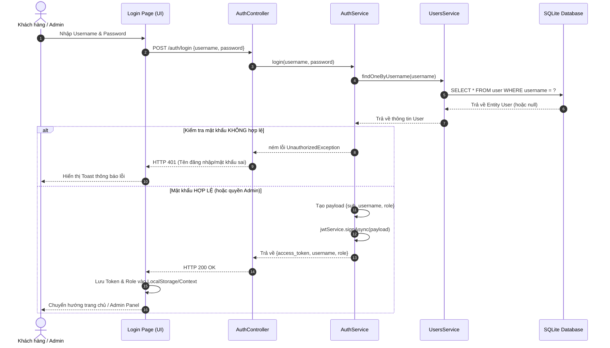
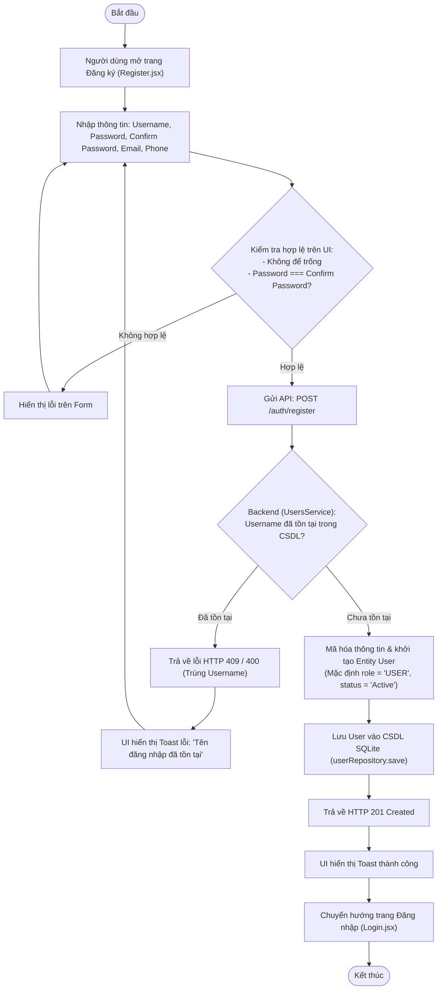
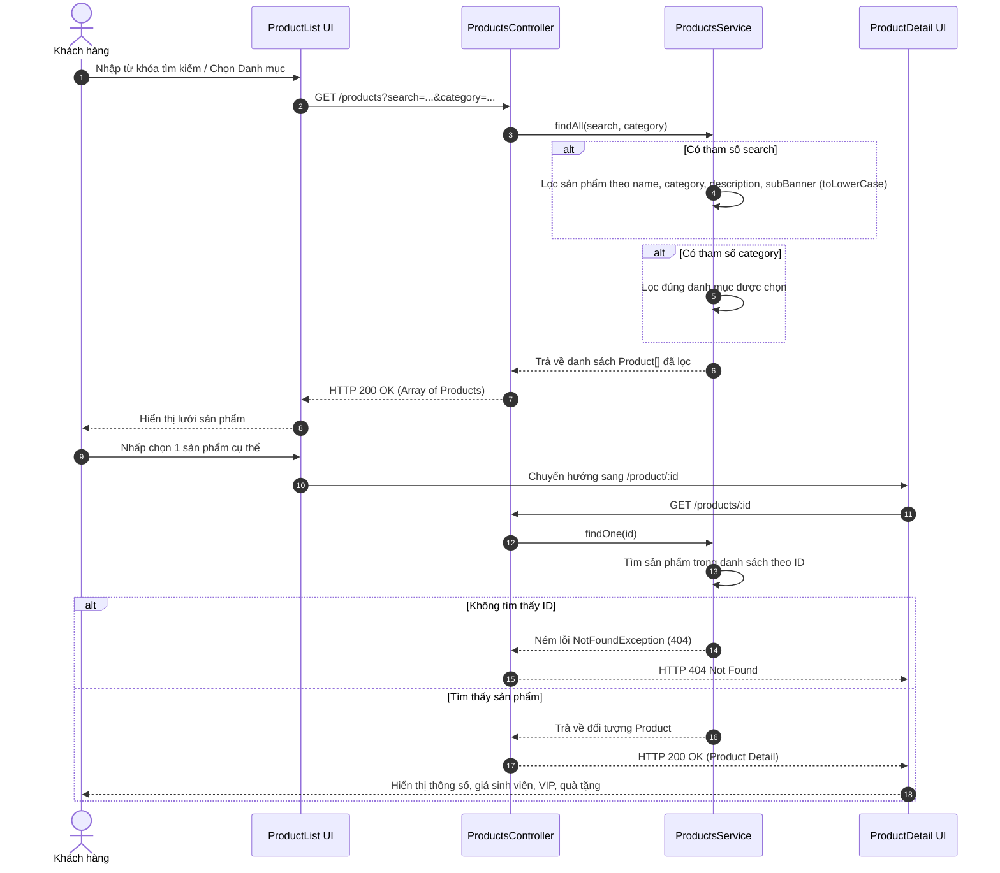
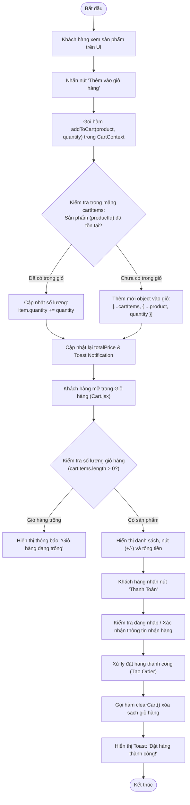
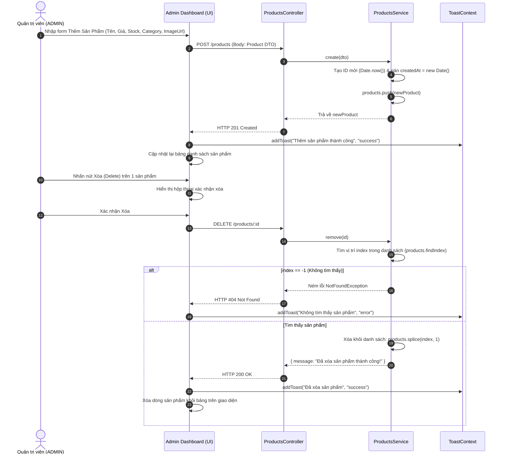

# 📚 TÀI LIỆU KIẾN TRÚC & SƠ ĐỒ THUẬT TOÁN HỆ THỐNG
**Dự án:** Website Bán Hàng Trực Tuyến (E-commerce)  
**Nhóm:** Hoa Cải Đỏ  

---

## 1. SƠ ĐỒ CẤU TRÚC LỚP (CLASS DIAGRAM - UML)

### 1.1. Sơ Đồ Cấu Trúc Lớp Backend (NestJS + TypeORM + SQLite)

```mermaid
classDiagram
    %% --- ENTITIES ---
    class User {
        +number id
        +string username
        +string password
        +string role
        +string email
        +string fullName
        +string phone
        +string status
        +Date createdAt
    }

    class Product {
        +string id
        +string name
        +string description
        +number price
        +number oldPrice
        +string badge
        +string subBanner
        +number rating
        +number reviewCount
        +number eduPrice
        +number vipPrice
        +string promotionText
        +number extraPromotions
        +number stock
        +string imageUrl
        +string category
        +Date createdAt
    }

    %% --- SERVICES ---
    class UsersService {
        -Repository~User~ userRepository
        +findAll() Promise~User[]~
        +findOne(id: number) Promise~User~
        +findOneByUsername(username: string) Promise~User~
        +create(userData: Partial~User~) Promise~User~
        +update(id: number, updateData: Partial~User~) Promise~User~
        +remove(id: number) Promise~void~
    }

    class ProductsService {
        -Product[] products
        +findAll(search?: string, category?: string) Product[]
        +findOne(id: string) Product
        +create(dto: Partial~Product~) Product
        +update(id: string, dto: Partial~Product~) Product
        +remove(id: string) { message: string }
    }

    class AuthService {
        -UsersService usersService
        -JwtService jwtService
        +register(data: Partial~User~) Promise~User~
        +login(username: string, pass: string) Promise~Object~
    }

    %% --- CONTROLLERS ---
    class UsersController {
        -UsersService usersService
        +findAll() Promise~User[]~
        +findOne(id: number) Promise~User~
        +create(body: Partial~User~) Promise~User~
        +update(id: number, body: Partial~User~) Promise~User~
        +remove(id: number) Promise~Object~
    }

    class ProductsController {
        -ProductsService productsService
        +findAll(search?: string, category?: string) Product[]
        +findOne(id: string) Product
        +create(body: Partial~Product~) Product
        +update(id: string, body: Partial~Product~) Product
        +remove(id: string) Object
    }

    class AuthController {
        -AuthService authService
        +register(body: Record~string, unknown~) Promise~User~
        +login(body: Object) Promise~Object~
    }

    %% --- RELATIONSHIPS ---
    UsersController ..> UsersService : Dependency (Injects)
    ProductsController ..> ProductsService : Dependency (Injects)
    AuthController ..> AuthService : Dependency (Injects)

    AuthService --> UsersService : Association (Uses)
    UsersService --> User : Repository / Performs CRUD
    ProductsService --> Product : Manages / Performs CRUD
```

---

### 1.2. Sơ Đồ Kiến Trúc Lớp & Quản Lý Trạng Thái Frontend (React + Vite)

```mermaid
classDiagram
    %% --- CONTEXTS ---
    class CartContext {
        +Array cartItems
        +number totalPrice
        +addToCart(product: Product, quantity: number) void
        +removeFromCart(productId: string) void
        +updateQuantity(productId: string, quantity: number) void
        +clearCart() void
    }

    class ToastContext {
        +Array toasts
        +addToast(message: string, type: string) void
        +removeToast(id: string) void
    }

    %% --- API LAYER ---
    class AxiosClient {
        +string baseURL
        +get(url: string, config?: Object) Promise
        +post(url: string, data?: Object) Promise
        +put(url: string, data?: Object) Promise
        +delete(url: string, config?: Object) Promise
    }

    %% --- PAGES & COMPONENTS ---
    class ProductList {
        -string searchTerm
        -string selectedCategory
        +fetchProducts() void
        +handleAddToCart(product: Product) void
        +render() JSX
    }

    class ProductDetail {
        -string productId
        -Product product
        +fetchProductDetail(id: string) void
        +handleBuyNow() void
        +render() JSX
    }

    class Cart {
        +handleCheckout() void
        +renderCartItems() JSX
        +render() JSX
    }

    class Login {
        -string username
        -string password
        +handleSubmit(event: Event) void
        +render() JSX
    }

    class Admin {
        -Array users
        -Array products
        -string activeTab
        +handleCreateProduct(data: Object) void
        +handleDeleteProduct(id: string) void
        +handleUpdateUserStatus(id: number) void
        +render() JSX
    }

    %% --- RELATIONSHIPS ---
    ProductList ..> AxiosClient : Calls API (GET /products)
    ProductDetail ..> AxiosClient : Calls API (GET /products/:id)
    Login ..> AxiosClient : Calls API (POST /auth/login)
    Admin ..> AxiosClient : Calls API (CRUD /products, /users)

    ProductList --> CartContext : Uses (addToCart)
    ProductDetail --> CartContext : Uses (addToCart)
    Cart --> CartContext : Uses & Observes state
    ProductList --> ToastContext : Uses (addToast)
    Admin --> ToastContext : Uses (addToast)
```

---

### 1.3. Bảng Giải Thích Chi Tiết Các Lớp & Vai Trò

| Lớp (Class) | Tầng / Vai trò | Mô tả chính |
| :--- | :--- | :--- |
| **`User`** | Entity (Model) | Ánh xạ với bảng `user` trong cơ sở dữ liệu SQLite thông qua TypeORM. Lưu trữ thông tin tài khoản, phân quyền (`ADMIN`, `USER`), trạng thái hoạt động. |
| **`Product`** | Model / Interface | Định nghĩa cấu trúc dữ liệu của sản phẩm bao gồm giá gốc, giá ưu đãi cho sinh viên (`eduPrice`), VIP (`vipPrice`), số lượng tồn kho (`stock`), hình ảnh và khuyến mãi đi kèm. |
| **`UsersController`** | Presentation / API Layer | Nhận các HTTP Request (`GET`, `POST`, `PUT`, `DELETE` tại endpoint `/users`), xử lý tham số đường dẫn (`id`) và chuyển tiếp tới `UsersService`. |
| **`ProductsController`** | Presentation / API Layer | Xử lý các HTTP Request liên quan đến sản phẩm (`/products`), hỗ trợ tìm kiếm theo từ khóa (`search`) và lọc theo danh mục (`category`). |
| **`AuthController`** | Presentation / API Layer | Tiếp nhận yêu cầu Đăng ký (`/auth/register`) và Đăng nhập (`/auth/login`), trả về JSON Web Token (`access_token`) và quyền truy cập cho phía Client. |
| **`UsersService`** | Business Logic Layer | Trực tiếp làm việc với cơ sở dữ liệu thông qua `Repository<User>` của TypeORM để thực hiện các thao tác thêm, sửa, xóa và truy vấn tài khoản. |
| **`ProductsService`** | Business Logic Layer | Chứa logic kiểm tra, lọc sản phẩm theo từ khóa, danh mục, cập nhật giá và tồn kho sản phẩm. |
| **`AuthService`** | Business Logic Layer | Xử lý nghiệp vụ xác thực người dùng, so khớp mật khẩu và ký phát hành Token JWT (`jwtService.signAsync`). |
| **`CartContext`** | Frontend State Layer | Quản lý giỏ hàng toàn cục trong phiên sử dụng của khách hàng, tính toán tổng tiền và cung cấp hàm thêm/sửa/xóa sản phẩm trong giỏ. |
| **`ToastContext`** | Frontend State Layer | Quản lý thông báo bật lên (Toast Notification) toàn cục cho ứng dụng. |

---

## 2. 05 SƠ ĐỒ THUẬT TOÁN & LUỒNG NGHIỆP VỤ (SEQUENCE & ACTIVITY DIAGRAMS)

### 2.1. Sơ Đồ 1: Quy Trình Xác Thực Đăng Nhập & Cấp Phát Token JWT *(Sequence Diagram)*



---

### 2.2. Sơ Đồ 2: Quy Trình Đăng Ký Tài Khoản Người Dùng Mới *(Activity Diagram)*



---

### 2.3. Sơ Đồ 3: Quy Trình Tìm Kiếm, Lọc & Xem Chi Tiết Sản Phẩm *(Sequence Diagram)*



---

### 2.4. Sơ Đồ 4: Quy Trình Thêm Vào Giỏ Hàng & Thanh Toán *(Activity Diagram)*



---

### 2.5. Sơ Đồ 5: Quy Trình Quản Trị Viên Thêm & Xóa Sản Phẩm *(Sequence Diagram)*



---

## 3. BÁO CÁO KIỂM THỬ VÀ KIỂM ĐỊNH HỆ THỐNG (TESTING & VERIFICATION)

Dự án sử dụng bộ khung kiểm thử **Jest & Supertest** trong NestJS để thực hiện kiểm định tự động từ mức đơn vị (Unit Test) cho tới toàn trình API (E2E Test), đảm bảo xử lý và bắt lỗi trong mọi trường hợp ngoại lệ.

### 3.1. Chiến Lược Bắt Lỗi & Xử Lý Ngoại Lệ (Exception Handling)
Hệ thống được thiết kế theo nguyên tắc *Defensive Programming* (Lập trình phòng thủ) và áp dụng các bộ xử lý lỗi của NestJS:
1. **Lỗi không tìm thấy dữ liệu (`NotFoundException - HTTP 404`)**:
   - Khi tìm kiếm, cập nhật hoặc xóa một sản phẩm không tồn tại trong hệ thống (ví dụ `GET /products/99999`), Service chủ động ném lỗi `NotFoundException("Không tìm thấy sản phẩm có ID: ...")`.
2. **Lỗi xác thực & bảo mật (`UnauthorizedException - HTTP 401`)**:
   - Khi người dùng đăng nhập sai mật khẩu hoặc tài khoản không tồn tại, `AuthService` chủ động từ chối và trả về HTTP 401 với thông báo rõ ràng *"Tên đăng nhập hoặc mật khẩu không chính xác!"*.
3. **Lỗi trùng lặp dữ liệu (`ConflictException - HTTP 409` / `BadRequestException`)**:
   - Kiểm tra trùng lặp `username` trước khi tạo mới trong CSDL SQLite.

---

### 3.2. Đơn Vị Kiểm Định (Unit Test)
Các file Unit Test được đặt trực tiếp trong các module của thư mục `backend/src/` và chạy bằng lệnh `npm test`:

* **`products.service.spec.ts` (10 ca kiểm định)**:
  - Kiểm định `findAll()`: Trả về danh sách mặc định, lọc đúng theo từ khóa (`search`) và danh mục (`category`).
  - Kiểm định `findOne()`: Trả về đúng sản phẩm khi ID tồn tại; **bắt lỗi ném ra `NotFoundException` khi ID không tồn tại**.
  - Kiểm định `create()`: Tạo sản phẩm mới thành công và tăng số lượng tổng.
  - Kiểm định `update()` & `remove()`: Cập nhật và xóa thành công; **bắt lỗi `NotFoundException` khi thao tác trên ID không hợp lệ**.
* **`auth.service.spec.ts` (7 ca kiểm định)**:
  - Kiểm định `login()`: Đăng nhập thành công với tài khoản Admin (`role: ADMIN`) và User (`role: USER`), kiểm tra gọi `jwtService.signAsync`.
  - **Kiểm định bắt lỗi bảo mật**: Ném ra `UnauthorizedException` khi sai mật khẩu hoặc tài khoản không tồn tại.
  - Kiểm định `register()`: Đăng ký tài khoản mới và gọi đúng hàm lưu vào CSDL.

**Kết quả chạy Unit Test (`npm test`):**
```text
PASS src/app.controller.spec.ts
PASS src/modules/products/products.controller.spec.ts
PASS src/modules/products/products.service.spec.ts
PASS src/modules/users/users.controller.spec.ts
PASS src/modules/users/users.service.spec.ts
PASS src/modules/auth/auth.controller.spec.ts
PASS src/modules/auth/auth.service.spec.ts

Test Suites: 7 passed, 7 total
Tests:       22 passed, 22 total
Time:        2.678 s
```

---

### 3.3. Kiểm Thử Toàn Trình Ứng Dụng (E2E Test)
Các ca kiểm thử E2E được đặt trong thư mục `backend/test/app.e2e-spec.ts` (khung làm việc chuẩn của NestJS) và chạy bằng lệnh `npm run test:e2e`:
* Kiểm thử endpoint gốc `/ (GET)`.
* Kiểm thử lấy danh sách sản phẩm `/products (GET)` trả về HTTP 200 OK.
* **Kiểm thử bắt lỗi API sản phẩm `/products/:id (GET)`** với ID không hợp lệ -> Trả về HTTP 404 Not Found.
* **Kiểm thử bắt lỗi API đăng nhập `/auth/login (POST)`** với mật khẩu sai -> Trả về HTTP 401 Unauthorized.
* Kiểm thử đăng nhập hợp lệ -> Trả về HTTP 201 Created kèm `access_token` và `role: ADMIN`.

**Kết quả chạy E2E Test (`npm run test:e2e`):**
```text
PASS test/app.e2e-spec.ts
  Kiểm thử E2E & Bắt lỗi hệ thống (e2e)
    Kiểm thử gốc (Root /)
      √ / (GET) - trả về Hello World! (246 ms)
    Kiểm thử & Bắt lỗi API Sản phẩm (/products)
      √ /products (GET) - trả về danh sách sản phẩm (200 OK) (20 ms)
      √ /products/:id (GET) - [Bắt lỗi] trả về 404 Not Found khi tìm ID không tồn tại (14 ms)
    Kiểm thử & Bắt lỗi API Xác thực (/auth)
      √ /auth/login (POST) - [Bắt lỗi] trả về 401 Unauthorized khi sai mật khẩu (25 ms)
      √ /auth/login (POST) - đăng nhập thành công với admin (200 OK) (19 ms)

Test Suites: 1 passed, 1 total
Tests:       5 passed, 5 total
Time:        1.929 s
```

